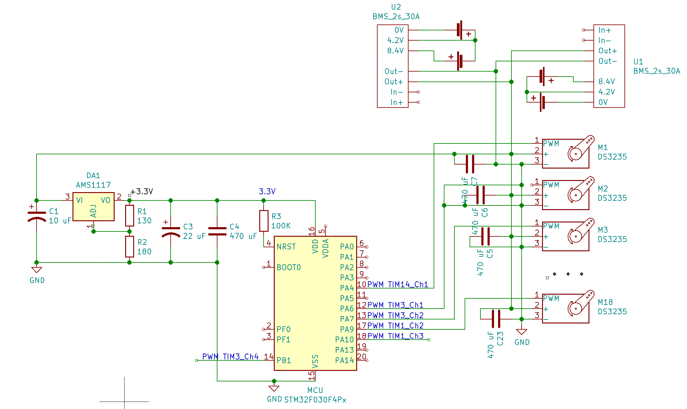

# PB171
Schematics and project

# Schematics:
# 2.2 Basic schematics
# 1
1) STM32F030F4:
VDD: 3.3 V,
Output pin; PA0.
2) AMS1117 regulator for stabilize voltage from 5V to 3.3V 
3) LED SMD 0402 body, 3.3V
I = 20 mA
R = (U - Uled) / I = (3.3 - 0.6(falling)) / 0.020 = 135 Om
https://www.amazon.com/50-0402-SMD-Blue-Bright/dp/B017TR4VM4

# 2
Pull-up mode

# 3

# 4

# 5

# 6
NTCLE100E3 101JB0
https://cz.mouser.com/datasheet/2/427/ntcle100-1762452.pdf
https://cz.mouser.com/ProductDetail/Vishay-BC-Components/NTCLE100E3101JB0?qs=%2Fha2pyFaduiiMUvKFVU6mnFRGUnzc019t%252BljiOX9xr22R2hIv7NwIA%3D%3D

# 7
I think I can use voltage divider for divide input voltage.
Max input voltage 12 V divide to 3.3 V and using ADC I can calculate input voltage.
Or not ?
Vout = (Vin * R2) / (R1 + R2)
Vin = 12V , R1 = 1000, Vout = 3.3V, R2 = 380
If (Vin == 12V) => ADC = 4095.

# 8
3-wire https://www.sparkfun.com/datasheets/Components/LED/YSL-R596CR4G3B5W-F12.pdf
and 
1-wire RGB LED (WS2812b) https://cdn-shop.adafruit.com/datasheets/WS2812.pdf
Common cathode (-).

# 2.3 Schematics with high power consumption
# 9
Brushless motor: https://hobbyking.com/en_us/turnigy-aerodrive-sk3-2826-980kv-brushless-outrunner-motor-1.html
Motor driver: https://hobbyking.com/en_us/aerostar-20a-electronic-speed-controller-with-2a-bec-2-4s.html
Driver was drawn by myself.

# 10
Servo motor datasheet: https://github.com/microrobotics/DS3235-270/blob/master/DS3235-270_datasheet.pdf
2S Li-on battery parallel = 7.4V.
Only 6 servo motors controlled by PWM is possible to connect to STM32F030F4 because only 6 PWM pins exists on this version MCU.

# 11
I use N MOSFET for PWM control DC motor SI2308DS. https://www.vishay.com/docs/70797/70797.pdf
When using MOSFET it’s necessary to use did, because the inductive surge from the motor will kill the transistor soon.

# 12
For both directions I use simple modern chip TA6586: https://datasheet.lcsc.com/szlcsc/1809091025_RZ-Wuxi-Smart-Microelectronics-TA6586_C128851.pdf
I works in voltage 3-14 V and max current 7A.

# 13
Oh, I almost done it in ‘9’ o_O
3S battery was added, so it should work :)

