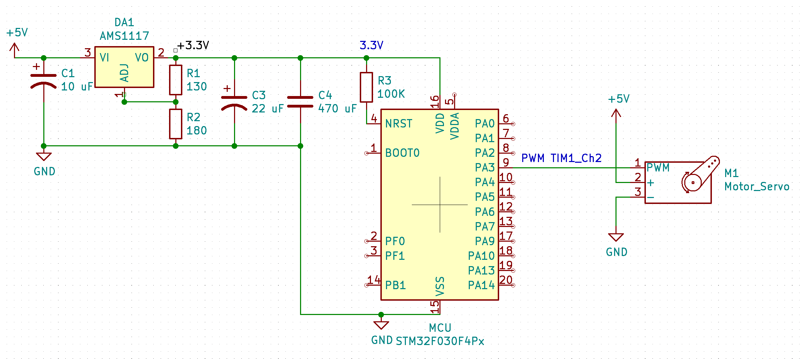

# PB171
Schematics and project

# Schematics:

MCU datasheet: https://www.st.com/en/microcontrollers-microprocessors/stm32f030f4.html#documentation
Regulator datasheet: https://www.google.com/url?sa=i&url=https%3A%2F%2Fpajenicko.cz%2Findex.php%3Froute%3Dproduct%2Fproduct%2Fget_file%26file%3Dams1117.pdf&psig=AOvVaw3BL6uwJyzgqzHhspaz3xXs&ust=1618701084359000&source=images&cd=vfe&ved=0CA0QjhxqFwoTCMD_iM3xg_ACFQAAAAAdAAAAABAD
Electrolytic capacitor in parallel supply MCU datasheet: https://cz.mouser.com/datasheet/2/977/e_YXS-1600637.pdf

Updated&Corrected 17.04

# 2.2 Basic schematics
# 1
Blue led: https://datasheet.lcsc.com/szlcsc/1810181751_TOGIALED-TJ-S3210SW5TGLC6B-A5_C273631.pdf
MCU output voltage is 3.3 V, so maybe it's not necessary to use resistor?? 
For example MCU output = 3.3 V, LED preffered voltage = 3.0 V, LED current = 0.020 A. 
R = (U - Uled) / I = (3.3 - 3.0) / 0.020 = 15 Om

# 2
Pull-up mode

# 3

# 4

# 5

# 6
NTCLE100E3 101JB0
https://cz.mouser.com/datasheet/2/427/ntcle100-1762452.pdf
https://cz.mouser.com/ProductDetail/Vishay-BC-Components/NTCLE100E3101JB0?qs=%2Fha2pyFaduiiMUvKFVU6mnFRGUnzc019t%252BljiOX9xr22R2hIv7NwIA%3D%3D

# 7
I think I can use voltage divider for divide input voltage.
Max input voltage 12 V divide to 3.3 V and using ADC I can calculate input voltage.
Or not ?
Vout = (Vin * R2) / (R1 + R2)
Vin = 12V , R1 = 1000, Vout = 3.3V, R2 = 380
If (Vin == 12V) => ADC = 4095.

# 8
3-wire https://www.sparkfun.com/datasheets/Components/LED/YSL-R596CR4G3B5W-F12.pdf
and 
1-wire RGB LED (WS2812b) https://cdn-shop.adafruit.com/datasheets/WS2812.pdf
Common cathode (-).

# 2.3 Schematics with high power consumption
# 9
Brushless motor: https://hobbyking.com/en_us/turnigy-aerodrive-sk3-2826-980kv-brushless-outrunner-motor-1.html
Motor driver: https://hobbyking.com/en_us/aerostar-20a-electronic-speed-controller-with-2a-bec-2-4s.html
Driver was drawn by myself.

# 10
Servo motor datasheet: https://github.com/microrobotics/DS3235-270/blob/master/DS3235-270_datasheet.pdf
2S Li-on battery parallel = 7.4V.
Only 6 servo motors controlled by PWM is possible to connect to STM32F030F4 because only 6 PWM pins exists on this version MCU.

# 11
I use N MOSFET for PWM control DC motor SI2308DS. https://www.vishay.com/docs/70797/70797.pdf
When using MOSFET it’s necessary to use did, because the inductive surge from the motor will kill the transistor soon.

# 12
For both directions I use simple modern chip TA6586: https://datasheet.lcsc.com/szlcsc/1809091025_RZ-Wuxi-Smart-Microelectronics-TA6586_C128851.pdf
I works in voltage 3-14 V and max current 7A.

# 13
Oh, I almost done it in ‘9’ o_O
3S battery was added, so it should work :)

